私は基本的に怠惰なので、本を買っても積んでしまっていた。

家にいるとついつい他ごとに手が伸びてしまうのだ（言い訳）。ベッドでごろ寝したり、Netflixを観たり、突然の掃除欲が湧いたり。。。

そこで、物理的に家から離れてしまうのはどうだろうか、と思い立った。そういえば過去に、読書合宿についての記事を読んで、いつかやりたいと思っていた。

<https://note.com/jibun_jikan/n/na6e99eca9cd1>

上記のような高級な場所は無理だが、安い旅館でのんびりしながら本を読むのはアリだなと考え、2026年2月21日に同期と本を携え湯河原に向かった。

## 湯河原駅到着

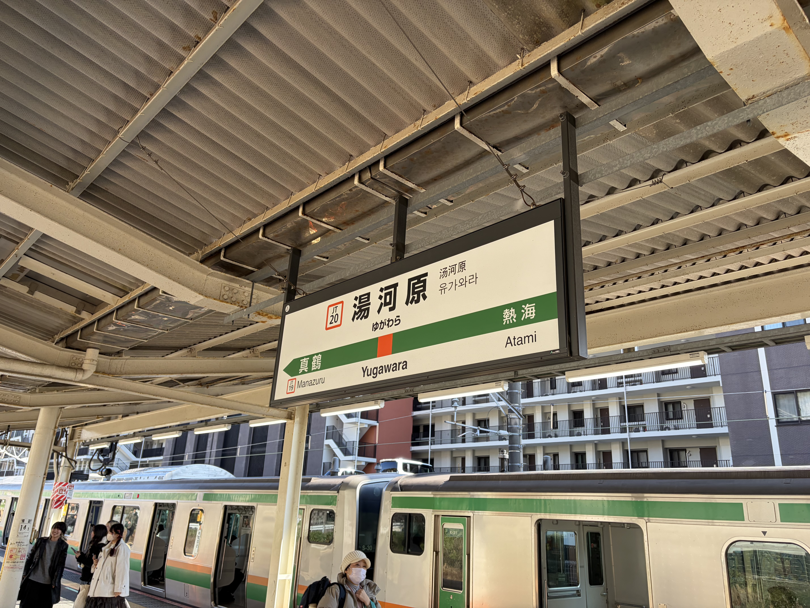

湯河原駅は東京からも行きやすい距離感なので、小旅行にぴったり。電車に揺られながら、窓の外に見える海に心を躍らせた。

湯河原駅のホームにある椅子も、とても可愛い座布団で我々を歓迎してくれた。

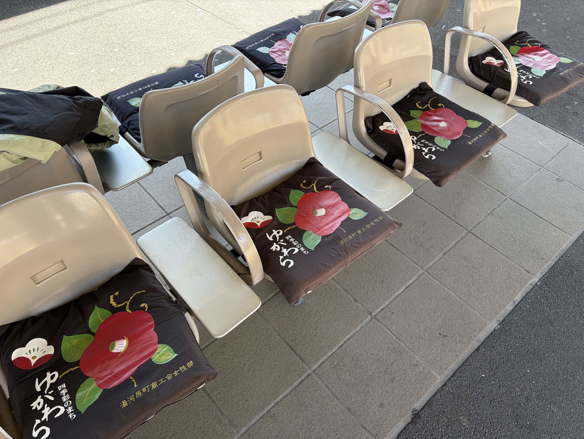

駅の改札を抜けるとさすが温泉街といったところか、手湯が出迎えてくれる。

自分は地元にいた頃はよく下呂に遊びに行っていたが、足湯はあれど（見逃してなければ）手湯は初めて見た。

なるほど、手湯は靴などを脱がなくて良いので、かなりカジュアルに楽しめる。

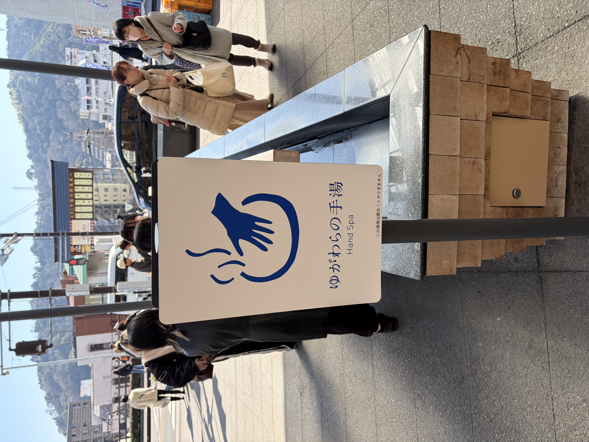

2月はまだ寒く、手湯の温かさに心まで溶かされたところで、まずは腹ごしらえ。

近くの案内所で地図を受け取り、それを頼りに飲食店を探す。あえてスマホは使わない縛りで行動することにしていた。

ブランチとして『わかむら』という喫茶店に行き、ボリューム満点の定食を注文した。

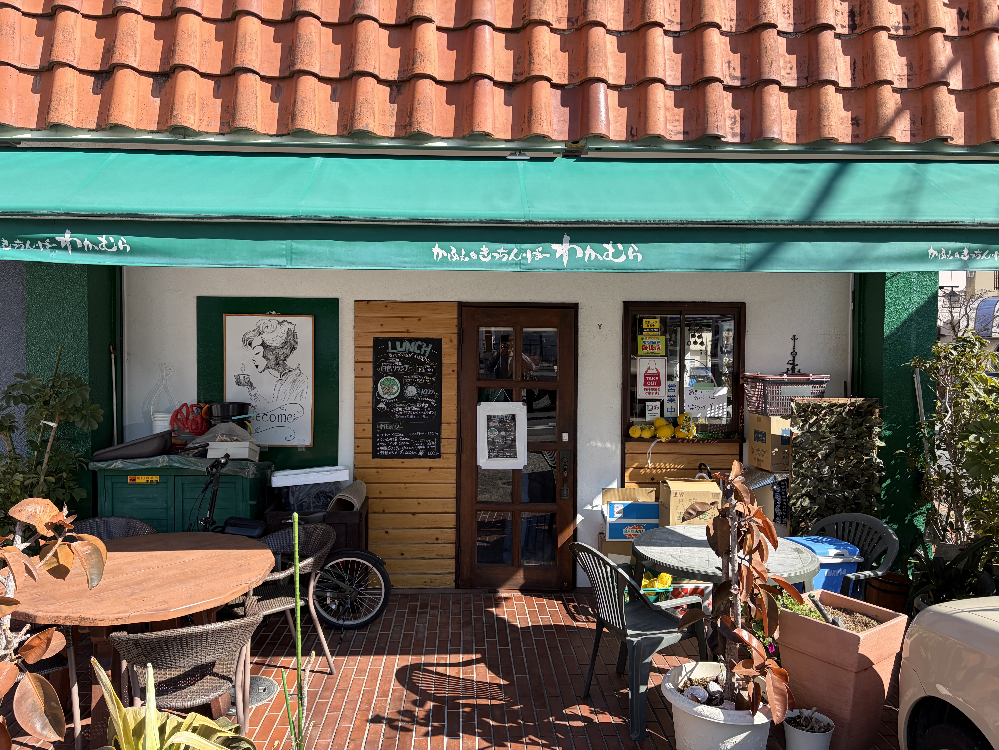

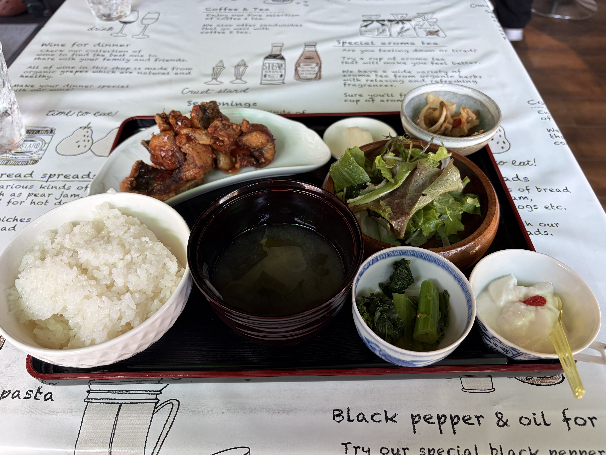

<https://tabelog.com/kanagawa/A1410/A141002/14028682/>

見てもらえればわかると思うが、定食だけでかなり大満足。

店主さんとの会話も楽しんでいたら、どうやらたまたま明日に湯河原で祭りがあるとのこと。

せっかくだし、と旅の予定に加えて私たちは『わかむら』を後にした。

---

## 海辺で読書

そろそろ読書をするか、と海が見えるところまで散歩する。湯河原の街並みは歩いて回れるほどのサイズ感で、駅から徒歩で山にも海にも行ける。

海辺に着く。潮の匂いや海風、波音が都会の忙しい雰囲気を吹き飛ばしてくれる。とても気持ちがいい。

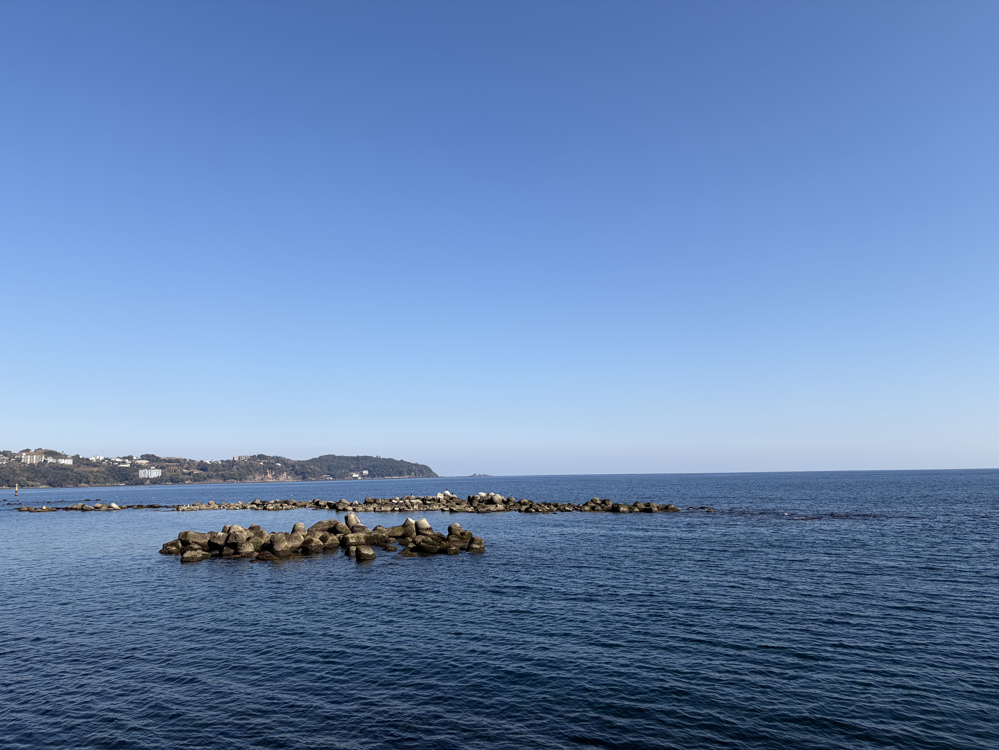

水平線を眺めながら伸びをして、読書に最適な場所を探して少しだけ歩いた。

階段状になっていて座りやすそうな場所を見つけ、そこに腰を下ろす。小さい子を遊ばせてる親子とか、釣りをしてるおじさんとかがいて、適度な雑音が逆に良さそうだと思った。

背負っていたリュックを下ろして、中から本を取り出す。

今回の旅で持ってきた本は、安斎勇樹さんの**『パラドックス思考』**。

<https://link.amazon/B07dAE06N>

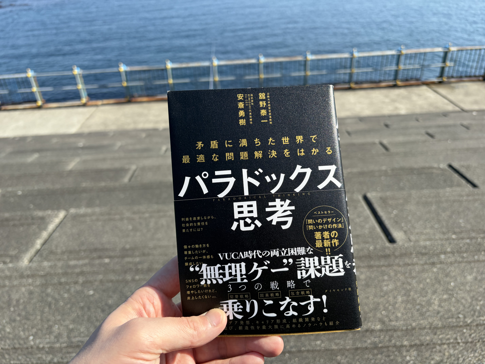

以前、以下の記事を書いた後に、会社の先輩に勧められた本だった。

<https://ebaryo.dev/blog/zero-sum-thinking-trap>

表現が難しいが、海辺で本を読んでいる自分に酔ってる感じがとても心地良い。スタバでMac開いてる人も、きっとこんな気分なんだろうな。

私はウキウキしながら本を広げた。

---

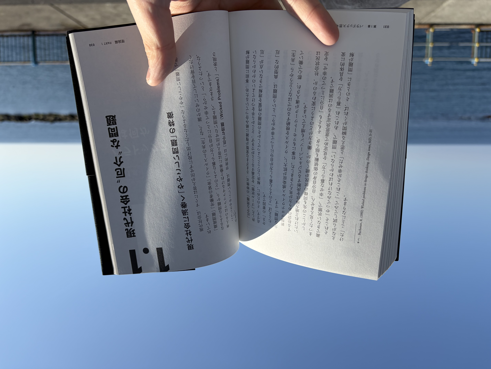

...2時間ほど読んだだろうか。

写真はかなり前半に撮ったものだが、実際には半分くらい読めた。本には現在の自分に刺さる内容が沢山書かれていて、勝手にダメージを受ける。

隣を見ると、海の音とポカポカ陽気で、同期がうたた寝をしていた。一体何をしにきたんだ君は。

そろそろチェックインの時間が迫っていたので、本を片付けて旅館に向かった。

## 宿にて

最初に載せた記事では、2泊3日の旅行にして旅館で読書を楽しむというものだったが、ケチって1泊2日にしたことでかなりセカセカと行動する必要があった。

旅館に着くなり温泉に入り、温泉から出たらご飯を食べて、地酒を購入して晩酌をし、気付いたら布団に挟まっていた。

布団に挟まってから、本を読んでないことに気づいた──。

---

## 湯河原 Day2

「今回の旅行は読書合宿である」ということを、今一度再認識して臨む。

チェックアウトをして、朝ごはんを食べるためにカフェに入る。かなりローカルな雰囲気のあるカフェだったが、写真を撮り忘れた。

ここも大ボリュームのカレーがあって、朝ごはんには重すぎて後悔した。

昨日『わかむら』で聞いた祭りの話を思い出す。

祭りというよりはフリマと言った方が良いだろうか、いろんな出店が道路に出ていた。太鼓を叩く人もいた。

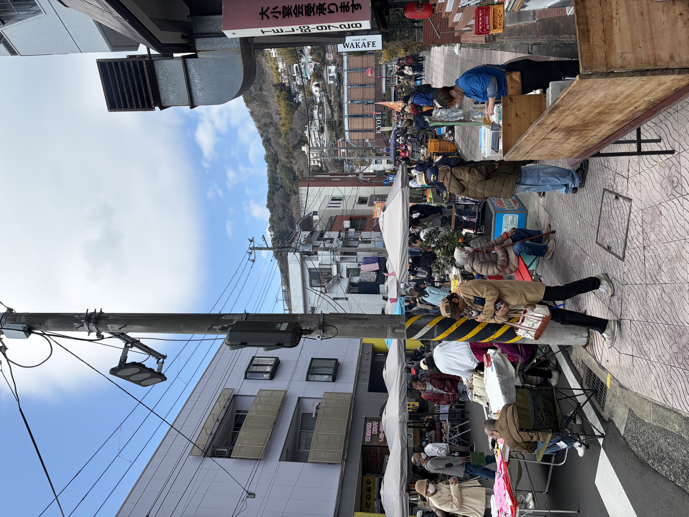

出店で面白そうな品を売っている人がいた。畳などで使う藺草（いぐさ）を使ったグッズの販売だ。

あまりにも可愛かったので、畳のコースターを購入した。思い出として残る良い買い物ができた。

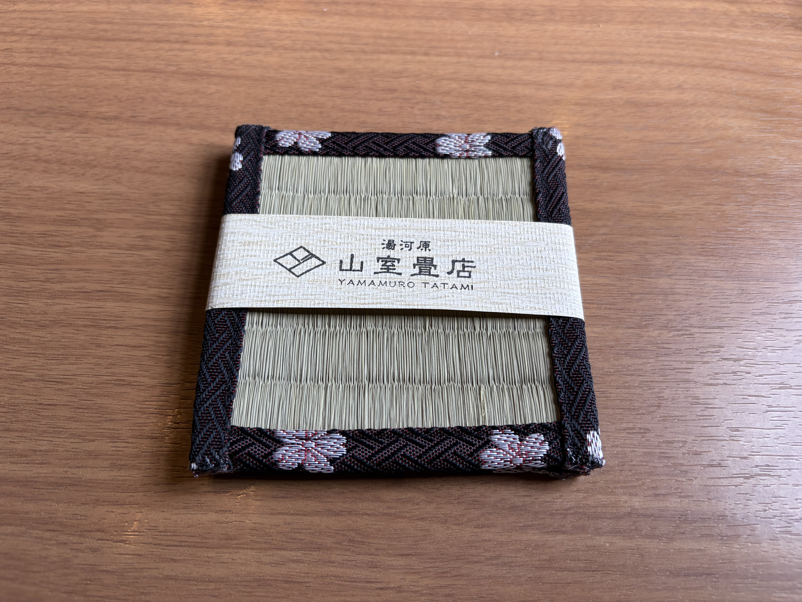

...いかんいかん、本を読まねば。

そう思い直し、祭りから離れて読書向きの場所を探しに向かった。

---

小川が流れている場所に来た。

三角公園のようなところにベンチがあって、そこで本を読むことにした。梅（？）も咲いていて、雰囲気が良い。

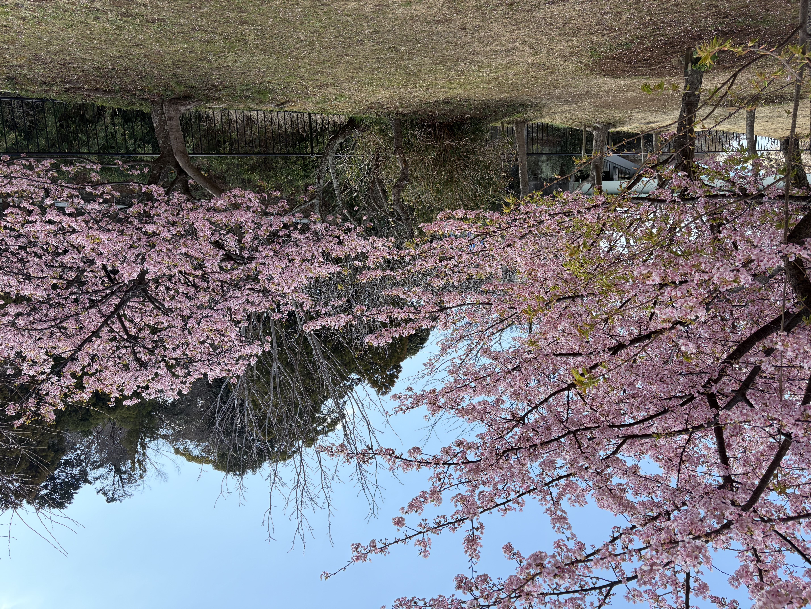

本の残りを読むべく、ベンチに腰掛ける。

同期はまたうたた寝をしている、自由なやつだな本当に。

横のベンチには犬を連れた夫婦がいて、川の景色を楽しんでいた。こんな、ゆっくりと時間が流れている感覚が自分は好きだなぁと思いながら本を開いた。

---

しばらく読んでから、お腹が空いたのでご飯を食べにいくことにした。三角公園と駅を結ぶ道にある、ビリヤニのお店に入った。

私はビリヤニを一度も食べたことがなかったので、少し緊張しながら注文したが、カレーっぽいチャーハンみたいな食べ物だった。

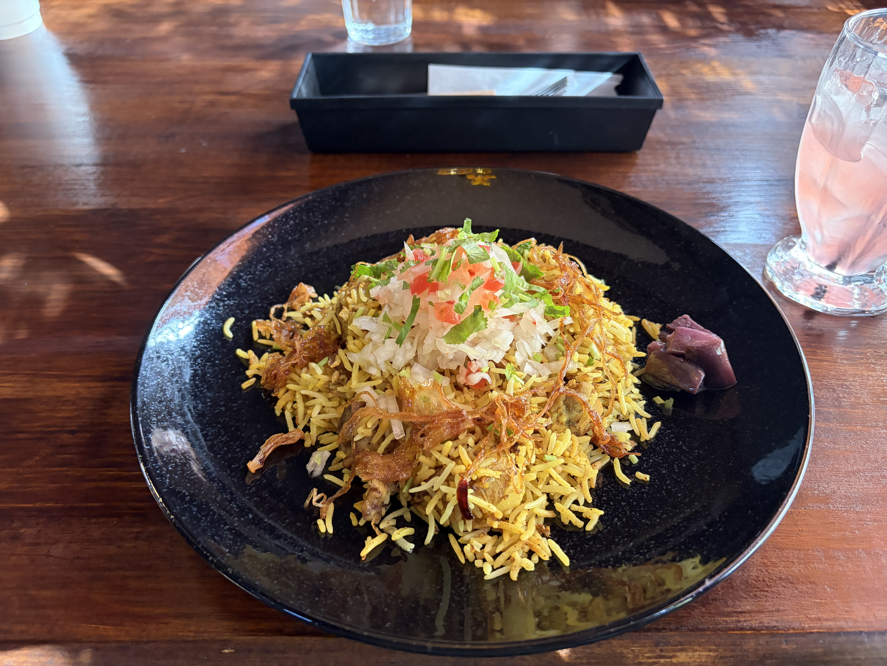

ビリヤニ食べながら、帰りの時間なんかについても話をした。せっかく湯河原に来たのだから、もう一度温泉に入ってから帰ろう、ということになった。

これは終わってみて思ったのだが、もし読書合宿をするなら予定はほとんど入れない方がいい。読書する時間が全く取れないからだ。

あと1泊じゃなくて2泊した方がいい。読書する時間が全く取れないからだ。

---

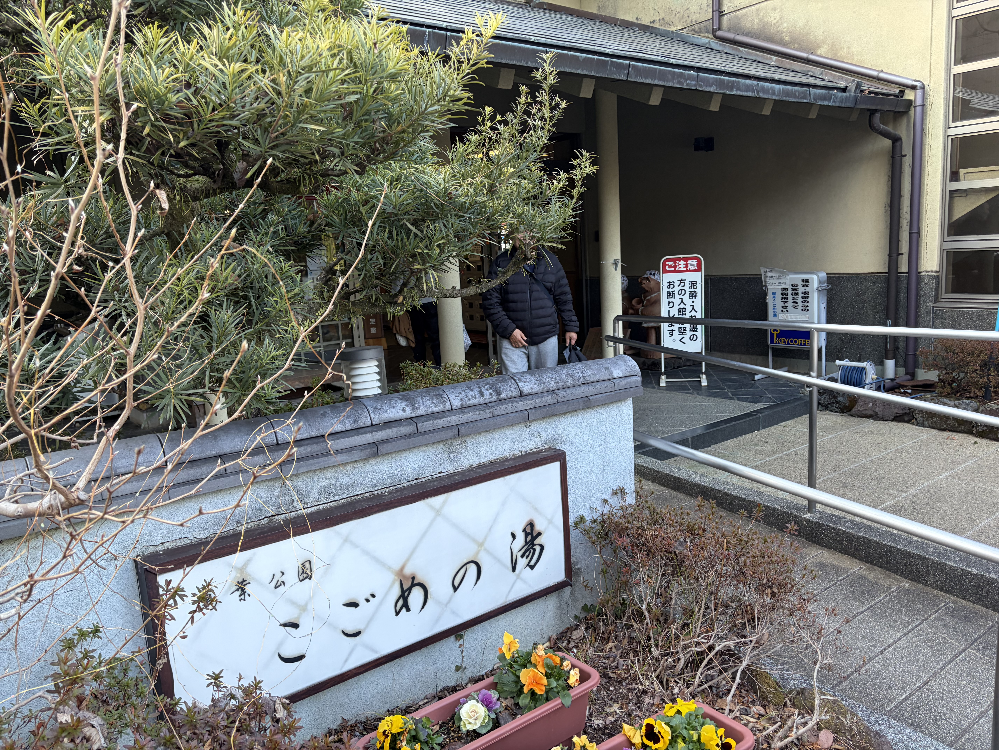

バスに乗って少し行ったところにある、『こごめの湯』というところまで来た。着いてから気づいたが、我々が歩き回っていた場所よりも遥かにこの辺りの方が観光に向いている場所だった。

ここには滝もあるし、観光客も多いし、なんか我々がいた場所は人が全然いなくて「なんか空いてるなー」なんて思いながら歩いていた。スマホ禁止の弊害である。

温泉に浸かりながら、今回の旅について語るなどした。まあ当たり前だが1泊2日の旅行に予定を詰めすぎて、読書が全然できなかった話で笑い合った。

まあ君は寝てたからってのもあるけどね…。

---

我々は今回の反省を次回の読書合宿に活かそう、と心に決めて、湯河原駅を発った。

次回があるのかは乞うご期待。
